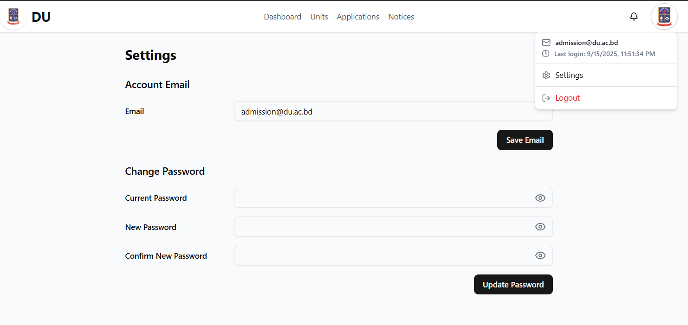

# UniForm — User Manual

This guide helps Students, Institutions, and Admins use UniForm.

> Live site URL: https://uniform-web-app.onrender.com/

---

## Student

### Sign Up / Login

-   Go to: `/student/registration` to create an account.
-   Go to: `/student/studentLogin` to sign in.
-   After login you land on the Student Dashboard.

### Dashboard

-   Quick access to Applications, Universities, Notices, Settings.

### Universities

-   Navigate: Header → Universities.
-   Browse eligible institutions (based on your academic info).
-   Open an institution to view details and available units.

### Applications

-   Navigate: Header → Applications.
-   View submitted applications; create or withdraw as allowed.
-   Open an application to see full details; download/print admit card if available.

### Notices

-   Navigate: Header → Notices.
-   Read system and institution academic notices.
-   Click a notice card to open its details page.

### Academic Info

-   Navigate: Header → Academic Info.
-   Add or update SSC/HSC (or equivalent) info to improve eligibility results.

### Settings

-   Navigate: Header → Settings.
-   Update profile, change password, manage preferences.

---

## Institution

### Login

-   Go to: `/institution/institutionLogin` and sign in with institution credentials.

### Dashboard

-   Overview of units, students, and applications.

### Notices (Institution)

-   Navigate: Notices.
-   Create academic notices for students; edit or delete existing notices.
-   Students will see institution academic notices in their feed.

### Applications

-   Navigate: Applications.
-   Review application lists; open a record to view full student details.

### Units

-   Navigate: Units.
-   Create, edit, and manage units for your institution.

### Profile & Settings

-   Update institution profile and basic settings.

---

## Admin (System)

### Login

-   Go to: `/admin/adminLogin` and sign in with admin credentials.

### Dashboard

-   Overview metrics across institutions, students, and applications.

### Institutions

-   Navigate: Institutions.
-   View and manage institutions; open details to review or update metadata.

### Admins

-   Navigate: Admins.
-   Manage system admin users.

### Notices (System)

-   Navigate: Notices.
-   Create, edit, delete system notices; choose Audience (Student, Institution, Both) and Category (General, Academic).

### Visualization

-   Navigate: Visualization.
-   Explore charts and insights.

### Profile & Settings

-   Update admin profile and platform settings as available.

---

## Tips & Troubleshooting

-   Unauthorized page → log in with the correct role (Student, Institution, Admin).
-   Changes not visible → refresh the page; ensure you are connected to the correct account.
-   Notices not opening → ensure you click the card or the notice link; if bookmarked, verify you’re signed in.

---
